# CS110 Project Proposal
# Binghamton University Map Trivia Game!
## CS 110 Final Project
###  Fall, 2022
### [Assignment Description](https://docs.google.com/document/d/1H4R6yLL7som1lglyXWZ04RvTp_RvRFCCBn6sqv-82ps/edit?usp=sharing)

Team #11

[Presentation Demo Link](https://docs.google.com/presentation/d/1JwHyYumrYvmyW5Zv2PsUML5qCxsKeuVND5h9ZmPW5cU/edit#slide=id.p)

### Team: Terrific Trivia!
#### Roisin Smith & Sarah Horvath 

***

## Project Description

Our project is a trivia game that displays a map of Binghamton University with some of the significant buildings. When the user clicks on one of the buidings, they are told what the building is asked a question. If the user inputs the correct answer, they get a point. 

***    

## User Interface Design

- **Initial Concept**
  - Here is an image of our inital concept for a user interface concept.
  * 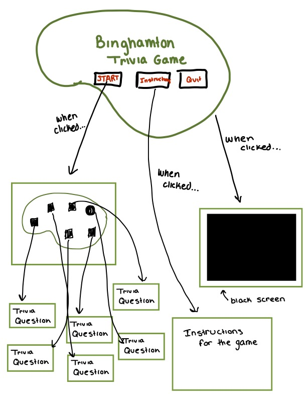
  - Description of each of the components:
    - The main screen will show three different buttons to launch the game. The user can choose start, instructions, or quit.
    - If the quit button is pressed, the screen will show a black screen and quit.
    - If the instructions button is pressed, the screen will display the instructions.
    - If the start button is pressed, the screen will show a map of Binghamton. When each building is clicked, it will load a trivia question for each. 

- **Final GUI**
  - Opening Menu:
    - 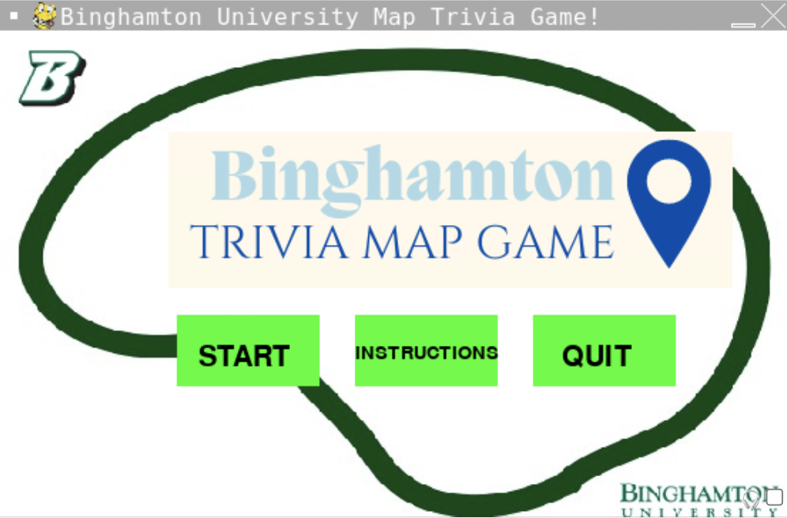
  - When the quit button is pressed:
    - 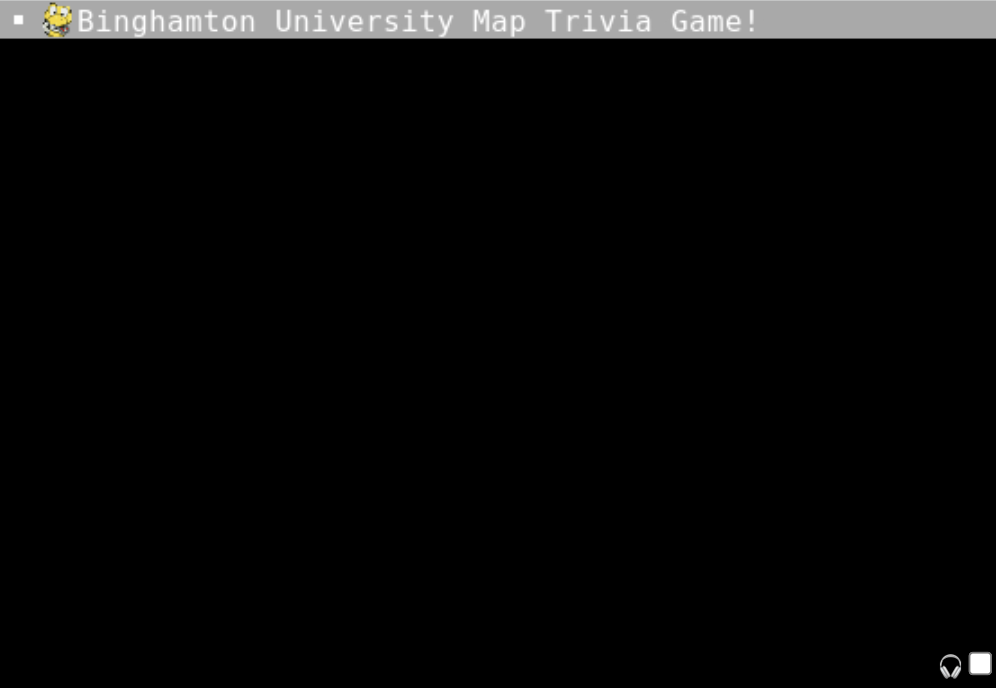
  - When the instructions button is pressed:
    - 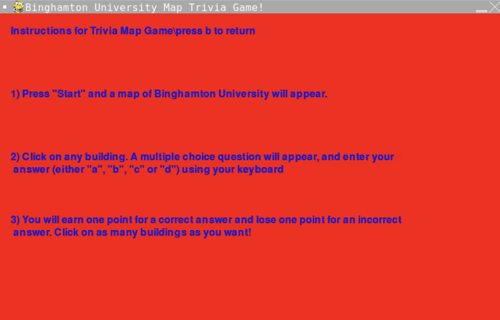
  - When the start button is pressed:
    - 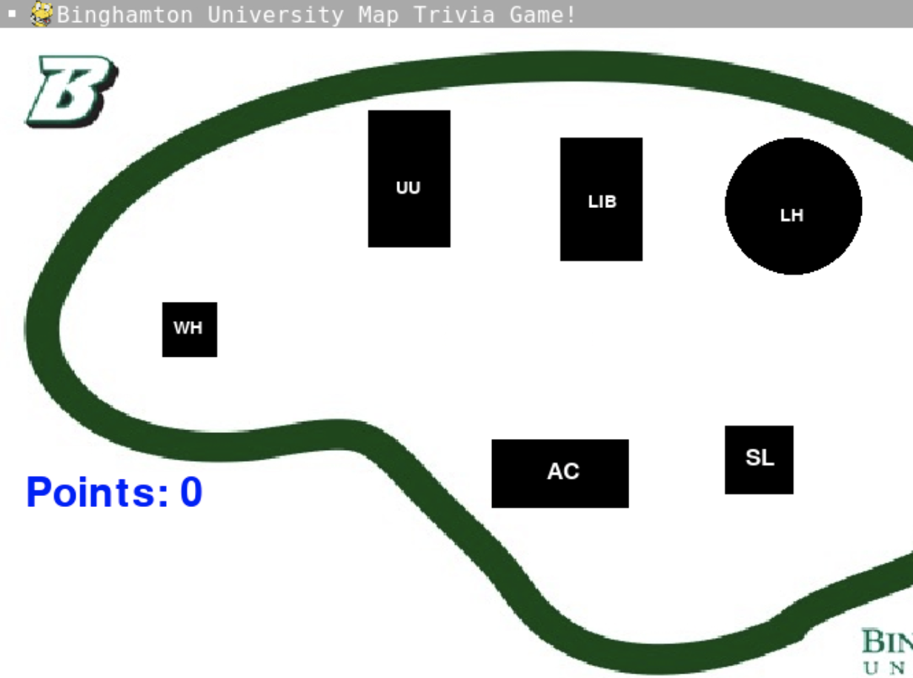
    - When Anderson Center is pressed:
      - 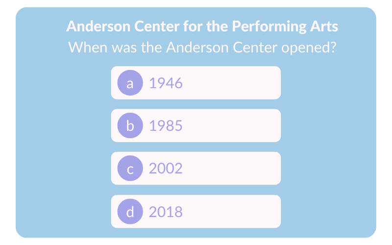
    - When Lecture Hall is pressed:
      - 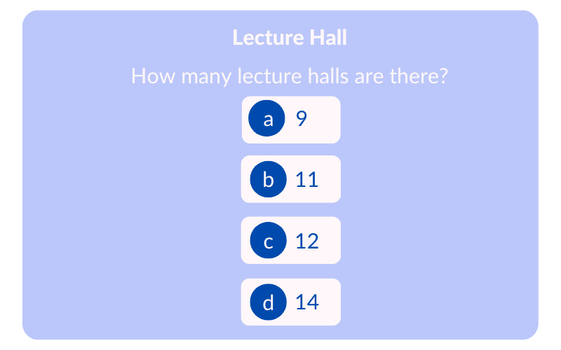
    - When Union is pressed:
      - 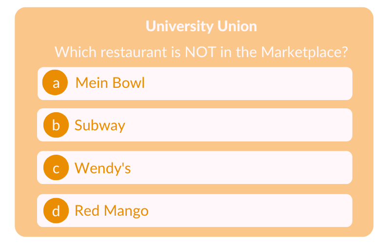
    - When Library is pressed:
      - 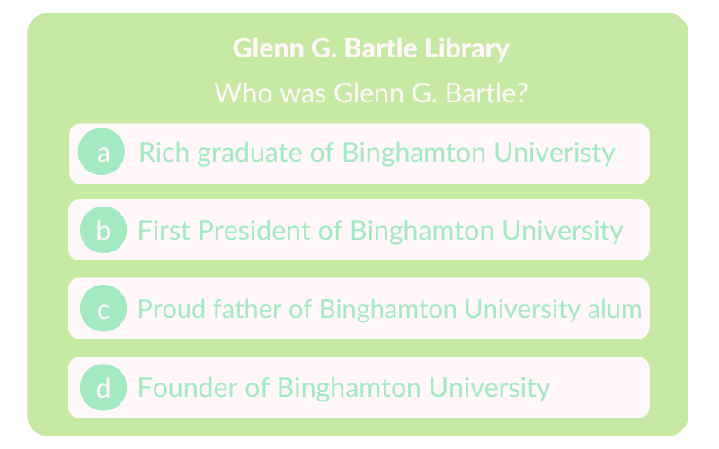
    - When Science Library Center is pressed:
      - 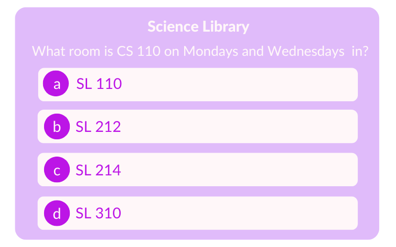
    - When Whitney is pressed:
      - 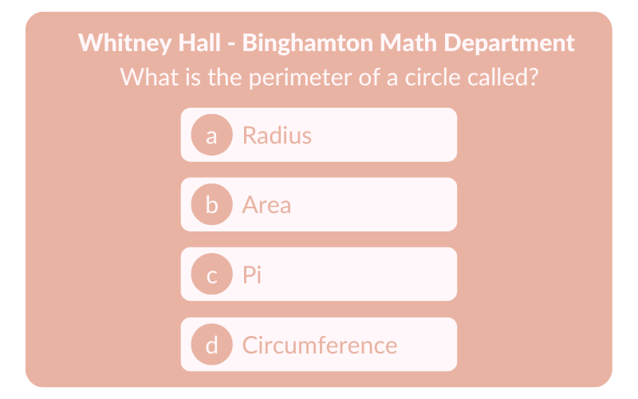

***        

## Program Design

* Non-Standard libraries

  - Pygame:
     - https://www.pygame.org/docs/
     - Pygame is a set of modules for making games. Pygame is known for being simple and easy to use to make games.

  - Json:
    - https://www.json.org/json-en.htmland
    - Json is a library that is used to store datat. In practice, it is used to combine and condense code to make programs more efficent.
     

* Class Interface Design
         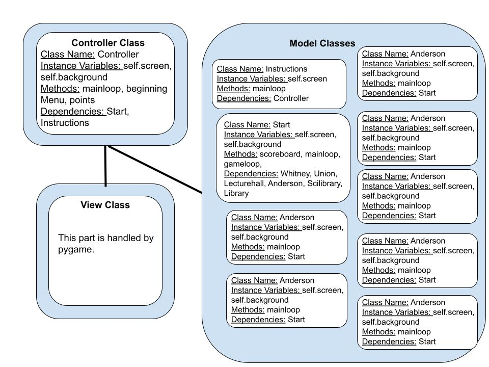

* Classes
  
  - **Class Anderson**
    - When the Anderson Center building is clicked on the map, this class is responsible for displaying the question about the Anderson Center. This class allows users to type their answer to the question, and then adds or subtracts a point depending on if the user got the question correct. Once the user types in their answer, the class returns the user to the main map to see if they got the answer right by looking at their point total!
  - **Class Controller:**
    - This class is the main controllor of the program. This class is responsible for creating the opening page to the trivia game and has the code for creating the "Start", "Instructions", and "Quit" buttons.
  - **Class Instructions:** This class contains the code that displays the instructions for the game when the "instructions" button is clicked. Its also responsible for returning the user to the main page when they enter "b" on the keyboard. 
  - **Class Lecturehall:**
    - When the Lecture Hall building is clicked on the map, this class is responsible for displaying the question about the Lecture Hall. This class allows users to type their answer to the question, and then adds or subtracts a point depending on if the user got the question correct. Once the user types in their answer, the class returns the user to the main map to see if they got the answer right by looking at their point total!
  - **Class Library:**
    - When the Library building is clicked on the map, this class is responsible for displaying the question about the Library. This class allows users to type their answer to the question, and then adds or subtracts a point depending on if the user got the question correct. Once the user types in their answer, the class returns the user to the main map to see if they got the answer right by looking at their point total!
  - **Class Quit:**
    - This class is responsible for quitting the program when the user clicks the "Quit" button. The class quits pygame as well as turns the screen black.
  - **Class Scilibrary:**
    - When the Science Library building is clicked on the map, this class is responsible for displaying the question about the Science Library. This class allows users to type their answer to the question, and then adds or subtracts a point depending on if the user got the question correct. Once the user types in their answer, the class returns the user to the main map to see if they got the answer right by looking at their point total!
  - **Class Start:**
    - This class contains the code that displays the map and creates the building buttons when the "start" button is clicked. The class also set up the points display on the map window and allowed the points from each question to be added to the points display.
  - **Class Union:**
    - When the Union building is clicked on the map, this class is responsible for displaying the question about the Union. This class allows users to type their answer to the question, and then adds or subtracts a point depending on if the user got the question correct. Once the user types in their answer, the class returns the user to the main map to see if they got the answer right by looking at their point total!
  - **Class Whitney:**
    - When the Whitney Hall building is clicked on the map, this class is responsible for displaying the question about the Whitney Hall. This class allows users to type their answer to the question, and then adds or subtracts a point depending on if the user got the question correct. Once the user types in their answer, the class returns the user to the main map to see if they got the answer right by looking at their point total!

      
## Project Structure and File List

The Project is broken down into the following file structure:

* main.py
* src
    * Anderson.py
    * Controllor.py
    * Instructions.py
    * Lecturehall.py
    * Library.py
    * Scilibrary.py
    * Start.py
    * Union.py
    * Whitney.py
* assets
    * anderson.png
    * classdiagram.jpg
    * initialConcept.jpg
    * instructions.png
    * introLogo.png
    * introMenu.png
    * lecturehall.png
    * library.png
    * Map.jpeg
    * quit.png
    * scilibrary.png
    * union.png
    * whitney.png
      * etc
    * building_data.json
    * button_data.json
    * milestone2.md

***

## Tasks and Responsibilities 

   * All of the classes were worked on collaboratively, both partners wrote code for each class and then helped the other with any problems. Sarah focused mainly on the opening page for the game and the questions, and Roisin focused on the setup of the buildings in the window and the text needed for the game. The Read.ME and ATP were also worked on collaboratively.

## Testing

* Our test strategy was to write out a little code at a time and debug anything not working properly. Once the code was working, only then would we move on to other parts.

## ATP

| Step             |Procedure                             |Expected Results        |   Comments                 | 
|----------------------|:--------------------:|:----------------------------------:|:-------------------------|
|  1                   | Open terminal, navigate to folder, and type, “python3 main.py”|The program begins and displays the trivia games opening page on the window  |    
|  2                   | Click "Quit" button  |Window appears black and quits  | 
|  3                   | Open terminal, navigate to folder, and type, “python3 main.py”|The program begins and displays the trivia game opening page  | 
|  4                  | Click on the "Instructions" button|A set of instructions on how to play the game appears on the window  | 
|  5                  | Press "b" on the computer keyboard|Returns to opening screen | 
|  6                  | Press the "Start" button  |The window display changes to a map of Binghamton's campus with six shapes, each representing a building, spread throughout the map, as well as "Points = 0" printed in the bottom left of the window | 
|  7                  | Click on the rectangle labled "WH"|The name of the building just clicked appears along with a multiple choice question with four answers | 
|  8                 | User enters "d" on their keyboard |Window returns to the map of the buildings and a point is added to the users total points, which is displayed on the screen | 
| 9                    | User enters "a", "b", or "c" on their keyboard |Window returns to the map of the buildings and a point is subtracted from the users total points, which is displayed on the screen |
| 10                   | User clicks on the rectangle labled "UU" |The name of the building just clicked appears along with a multiple choice question with four answers |
| 11                   | User enters "c" on their keyboard | The window returns to the map of the building s and a point is added to the users total points, which is displayed on the screen |
| 12                   | User enters "a", "b", or "d" on their keyboard | Window returns to the map of the buildings and a point is subtracted from the users total points, which is displayed on the screen |
| 13                   | User clicks on the rectangle labled "LIB" | The name of the building just clicked appears along with a multiple choice question with four answers | 
| 14                   | User enters "b" on their keyboard | The window returns to the map of the buildings and a point is added to the users total points, which is displayed on the screen |
| 12                   | User enters "a", "c", or "d" on their keyboard | Window returns to the map of the buildings and a point is subtracted from the users total points, which is displayed on the screen |
| 13                   | User clicks on the circle labled "LH" |The name of the building just clicked appears along with a multiple choice question with four answers | 
| 14                   |User enters "d" on their keyboard | The window returns to the map of the building s and a point is added to the users total points, which is displayed on the screen |
| 15                   | User enters "a", "b", or "c" on their keyboard | Window returns to the map of the buildings and a point is subtracted from the users total points, which is displayed on the screen |
| 16                   | User clicks on the rectangle labled "AC" |The name of the building just clicked appears along with a multiple choice question with four answers | 
| 17                   |User enters "b" on their keyboard | The window returns to the map of the building s and a point is added to the users total points, which is displayed on the screen |
| 18                   | User enters "a", "c", or "d" on their keyboard | Window returns to the map of the buildings and a point is subtracted from the users total points, which is displayed on the screen |
| 19                    | User clicks on the rectangle labled "SL" |The name of the building just clicked appears along with a multiple choice question with four answers | 
| 20                    |User enters "b" on their keyboard | The window returns to the map of the building s and a point is added to the users total points, which is displayed on the screen |
| 21                    | User enters "a", "c", or "d" on their keyboard | Window returns to the map of the buildings and a point is subtracted from the users total points, which is displayed on the screen |

